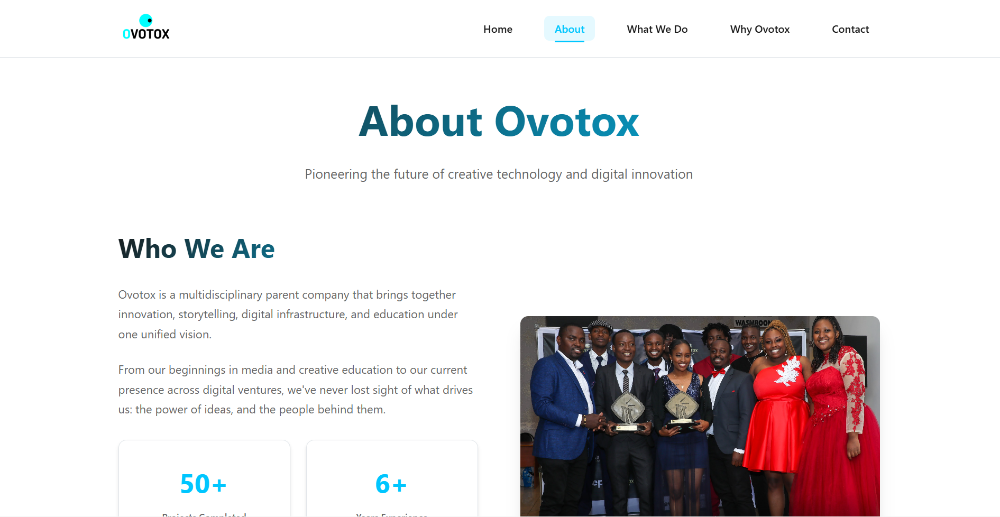

# Ovotox - Creative Technology & Digital Innovation

A modern, responsive website for Ovotox - a multidisciplinary company specializing in creative technology, digital innovation, and multimedia solutions.

## 🌟 Overview

Ovotox is a future-focused company creating meaningful solutions across the intersections of creativity, technology, and human experience. This website showcases our services, projects, and vision through an immersive digital experience.

### Key Features

- **Modern Design**: Clean, professional interface with smooth animations
- **Fully Responsive**: Optimized for all devices and screen sizes
- **Interactive Elements**: Engaging animations using Framer Motion
- **Multi-page Navigation**: Seamless routing with React Router
- **Contact Integration**: EmailJS-powered contact form
- **Accessibility**: WCAG compliant with proper ARIA labels
- **Performance Optimized**: Lazy loading and optimized assets

## 🖼️ Screenshots

### Home Page

### About Page

### What We Do Page

*More screenshots available in the [screenshots folder](./screenshots)*

## 🎥 Video Demo

*Click above to watch the full website demo video*

### Demo Highlights
- **Smooth Animations**: Framer Motion transitions and micro-interactions
- **Responsive Design**: Mobile-first approach across all devices
- **Interactive Components**: Partners carousel, service navigation, and contact form
- **Performance**: Fast loading times and optimized user experience

## 🛠 Tech Stack

### Frontend
- **React 18** - Modern UI library
- **TypeScript** - Type-safe development
- **Framer Motion** - Smooth animations and transitions
- **React Router** - Client-side routing
- **React Hook Form** - Form validation and management
- **EmailJS** - Contact form integration

### Styling
- **CSS3** with custom properties (CSS Variables)
- **Flexbox & Grid** - Modern layout techniques
- **Responsive Design** - Mobile-first approach

### Development Tools
- **Vite** - Fast build tool and dev server
- **ESLint** - Code linting
- **Git** - Version control

